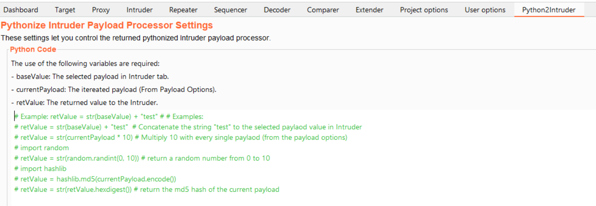

<hr>
 <h1 align="center">Pythonize Intruder Payload Processor</h1>
 
 <p align="center">

</p>

<hr>
Pythonize Intruder Payload Processor extension lets you customize the payload through Python code

### Pythonize Intruder Payload Processor
Python2Intruder extension handles the base value of the selected Intruder payload, the current payload from the payload options and it returns the processed python code to the Intruder.

### Usage
The use of the following variables are required:
- baseValue: The selected payload in Intrudor tab
- currentPayload: The itereated payload (From Payload Options).
- retValue: The returned value to the Intruder

 ```
# Example: retValue = str(baseValue) + "test" # # Examples:
# retValue = str(baseValue) + "test"  # Concatenate the string "test" to the selected paylaod value in Intruder
# retValue = str(currentPayload * 10) # Multiply 10 with every single paylaod (from the payload options)
# import random
# retValue = str(random.randint(0, 10)) # return a random number from 0 to 10
# import hashlib 
# retValue = hashlib.md5(currentPayload.encode()) # return the md5 hash of the current payload
  
```

#### Build the Project
Use the following command to build the Jar file.
> mvn clean install

#### TODO:
     - [ ] Add Presets Python Functions


#### Bugs / Feedback / PRs
Any comment, issue or pull request will be highly appreciated :)

#### Author
b1twis3 - https://twitter.com/fasthm00
